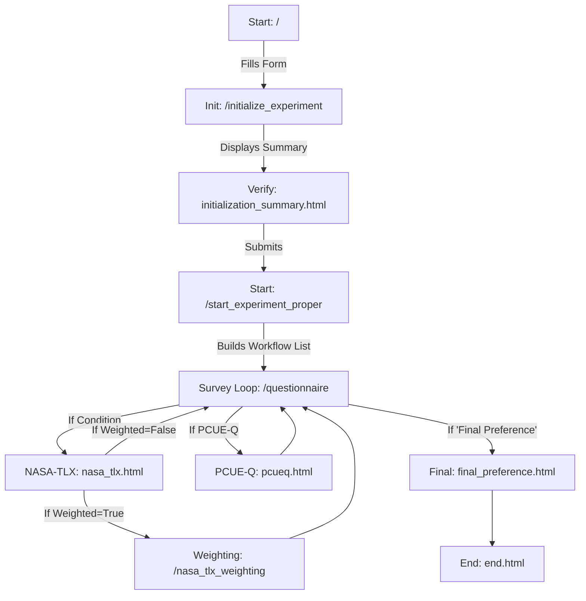

# Survey Application - Experiment Questionnaire Form

This document provides complete instructions for setting up, configuring, and analyzing data for the **experiment questionnaire form system**. Designed to evaluate participant reactions during trials across varying main conditions.

---

## Table of Contents
1.  [Setup & Installation](#1-setup--installation)
2.  [Configuration Guide](#2-configuration-guide)
3.  [System Architecture & Flow](#3-system-architecture--flow)
4.  [Data Structure & Analysis](#4-data-structure--analysis)

---

## 1. Setup & Installation

This section describes how to install and run the survey applications.

### Prerequisites
-   **Python 3.x**: Ensure Python 3 is installed and added to your system PATH.
-   **pip**: The Python package installer.

### Environment Setup
It is highly recommended to use a virtual environment to manage dependencies locally.

```bash
# Navigate to the project directory
cd /path/to/survey

# Create the environment
python -m venv venv
```

**Activating the Environment**:
*   *Windows (PowerShell)*: `.\venv\Scripts\Activate.ps1`
*   *Windows (CMD)*: `.\venv\Scripts\activate.bat`
*   *macOS / Linux*: `source venv/bin/activate`

### Install Dependencies
```bash
pip install flask appJar pyopenssl
```
> [!NOTE]
> `appJar` is required for the desktop GUI (`nasa-tlx.py`). `pyopenssl` allows adhoc HTTPS securely.

### Running the Flask Web Application (`app.py`)
```bash
python app.py
```
*   Runs on **port 5001** responding on all interfaces (`0.0.0.0`).
*   **Local Access**: `http://localhost:5001`
*   **Local Network IP Access**: e.g., `http://192.168.1.15:5001` (from tablet devices on the same Wi-Fi).

### Running the Desktop GUI (`nasa-tlx.py`)
```bash
python nasa-tlx.py
```
To package as a standalone executable (Windows index):
```bash
pip install pyinstaller
pyinstaller --onefile --noconsole nasa-tlx.py
```

---

## 2. Configuration Guide

The survey application uses `config.json` for settings layout trackers.

### `config.json` Example
```json
{
    "main_conditions": [
        "On-Screen",
        "AR-OST (Hololens)",
        "AR-VST (Quest 3)"
    ],
    "weighted": false,
    "question_font_size": 1.6,
    "description_font_size": 1.4,
    "global_font_size": 1.5
}
```

### Active Fields
*   **`main_conditions`** (List of Strings)
    *   Defines experimental condition systems participants will cycle through. Shuffled randomly on start.
*   **`weighted`** (Boolean)
    *   `false`: Standard unweighted NASA-TLX score average averages.
    *   `true`: Appends a 15 pairwise questions cycle multiplier calculator endpoint.
*   **Font sizes** (`global_font_size`, `question_font_size`, `description_font_size`)
    *   Dynamic sizing sliders modifying standard `rem` heights supporting readable viewport heights.

### UI Modifier Updates
Update parameters directly sitting inside browser forms using route: `/settings` (e.g., `http://localhost:5001/settings`).

---

## 3. System Architecture & Flow

Linear step pipeline tracking progress directly driving strictly strict indexes lists inside session variables.



### Route Nodes Overview
-   **`/`**: Initial demographics form conditions collection.
-   **`/questionnaire`**: Sequential cycles pulling workflows elements condition headers looping.
-   **`/review`**: Read grouped participants row tables back assessing quality checks.

---

## 4. Data Structure & Analysis

Saves immediate responses natively inside standard `results.csv`.

| Header | Description | Example |
| :--- | :--- | :--- |
| **`timestamp`** | ISO datetime responses appended. | `2026-03-24T12:00:00` |
| **`user_id`** | Unique session trigger key track. | `user_20260324120000` |
| **`questionnaire`** | Typename identification source string. | `nasa_tlx`, `pcueq` |
| **`key`** / **`value`** | Direct dictionary fields elements response. | `q0` (Mental) / `45` |

### Analysis Quick Start (Python/Pandas)
Use flat string pivots sorting table matrices variables formulas:

```python
import pandas as pd
df = pd.read_csv('results.csv')

# Pull items only
tlx_df = df[df['questionnaire'] == 'nasa_tlx']

# Pivot rows so 'key' triggers column weights
pivot = tlx_df.pivot_table(index=['user_id', 'condition'], columns='key', values='value', aggfunc='first').reset_index()
print(pivot.head())
```
